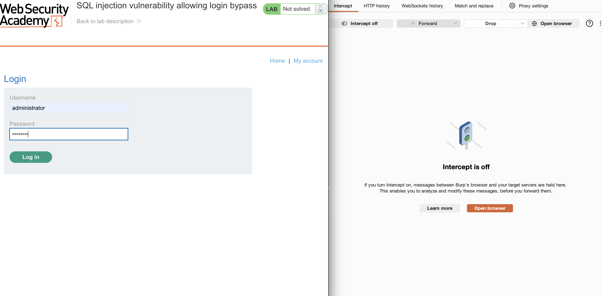

# Lab: SQL injection vulnerability in WHERE clause allowing retrieval of hidden data

## Objective: Demonstrate how to exploit an SQL injection vulnerability in the categories filter to access restricted product data that is normally hidden from users. This write-up will guide you through the discovery, exploitation, and interpretation of results, providing clear steps to achieve the lab’s goal.

## Steps

### Step 1: Explore the Website Layout

Start by opening the PortSwigger lab and browsing through the site to get a feel for its structure. Click through the available pages and take note of any input fields or filters that interact with the application. In this lab, the only field that stands out as a potential SQL injection point is the categories filter, which controls what products are displayed. Make a note of this filter, as it will be the focus of your testing in the next step.

### Step 2: Intercept the Categories Filter Request with Burp Suite

With Burp Suite running, click on a category in the lab. In the Proxy tab of Burp Suite, ensure the intercept button is on and select the HTTP request generated by clicking the category. This request will be used to identify a potential SQL injection in the next steps.

### Step 3: Find and Forward the Request for Testing

Next, go to the HTTP history and locate the request you selected in the previous step. Right-click on this request and send it to the Repeater tab. You’ll use the Repeater to test different SQL injection payloads and observe how the server responds.

### Step 4: Analyze the Request in the Repeater Tab

Switch to the Repeater tab to view the full HTTP request you just sent. Here, you can see all the parameters in the request. Notice the category parameter (such as “Accessories”). This is where you can try injecting SQL payloads to test for vulnerabilities.

### Step 5: Test for SQL Injection

In the Repeater tab, modify the category parameter by replacing the current item with '+OR+1=1-- to test for SQL injection. Send the modified request. If you receive an HTTP 200 response, the attack succeeded. 

### Step 6: Confirm Lab Completion

After sending the successful SQL injection, the lab will display a congratulations message and reveal the previously hidden unreleased products. This confirms you’ve solved the lab.

## Key Takeaways

- Systematic Exploration: Start every assessment by exploring the application thoroughly to identify all possible input points for vulnerabilities.
- Effective Use of Burp Suite: Tools like Burp Suite make it easier to intercept, analyze, and manipulate HTTP requests, which is crucial for identifying and testing web vulnerabilities.
- Target the Right Parameters: Not all input fields are vulnerable; focusing on parameters that interact with backend data (like category filters) increases your chances of finding security issues within web applications.
- Payload Testing: Simple SQL injection payloads (such as '+OR+1=1--) can be effective for quickly checking if an input is vulnerable.
- Analyzing Server Responses: HTTP response codes and changes in the application’s output (like seeing previously hidden data) help confirm whether your exploit was successful.
