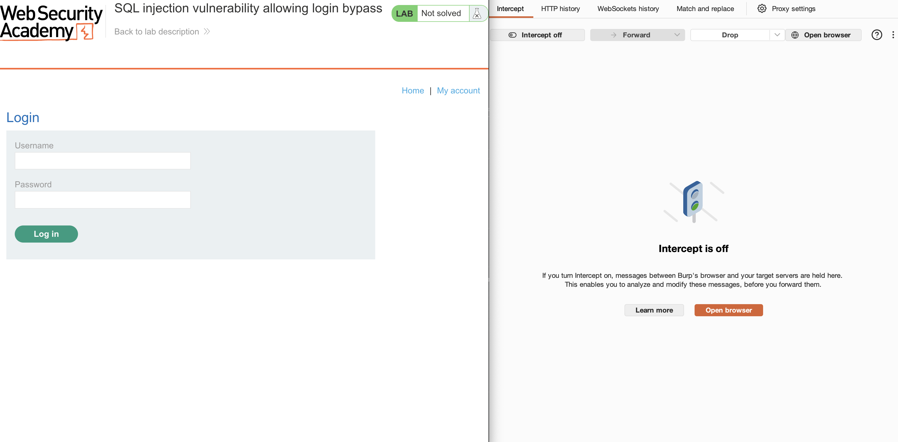
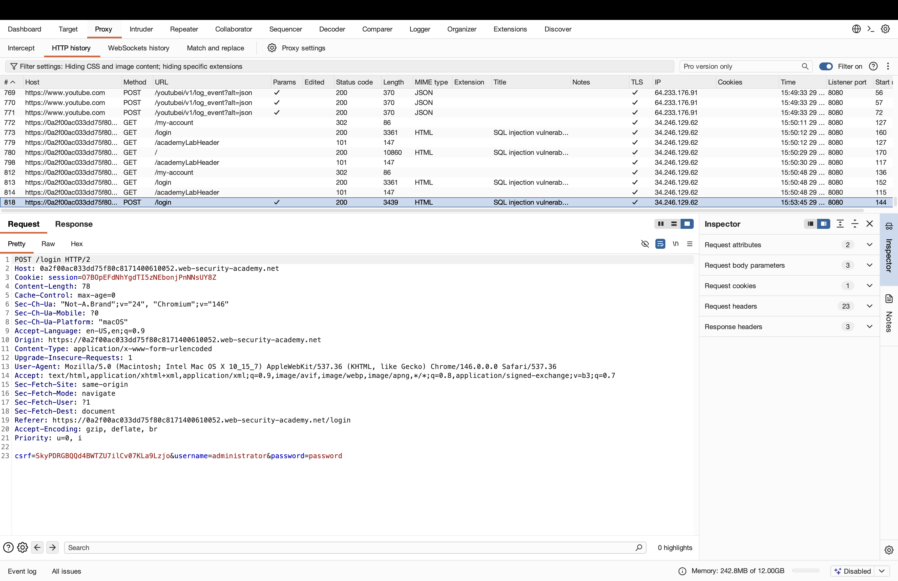
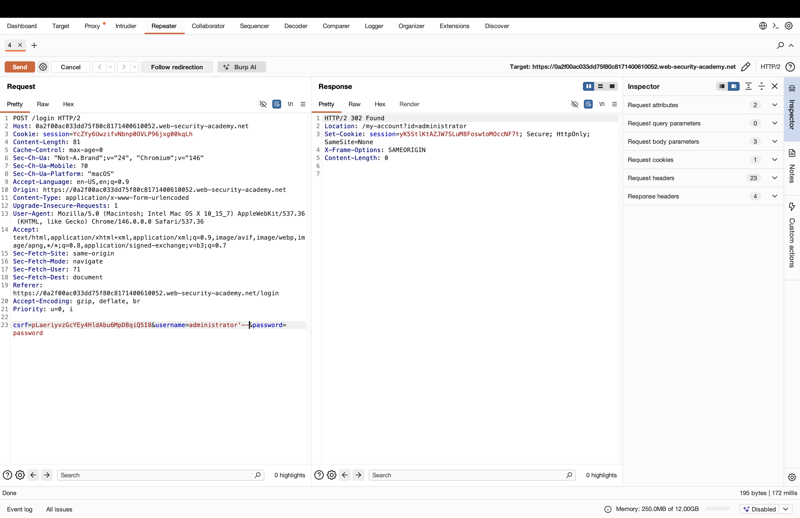
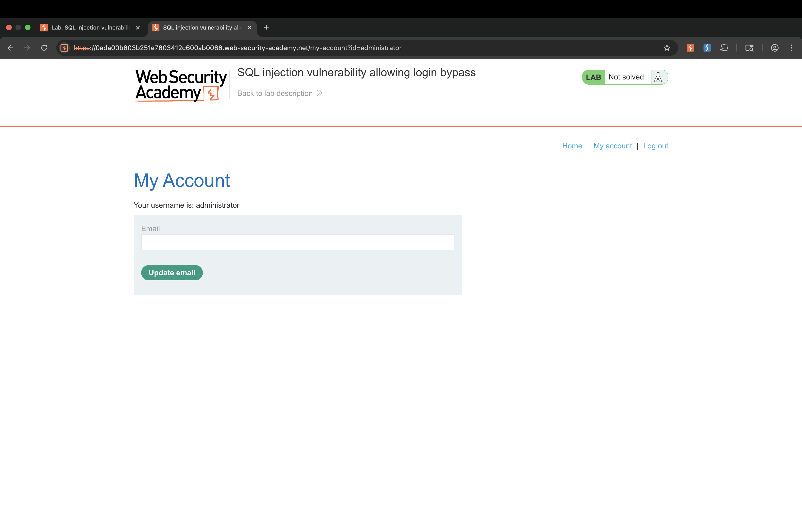
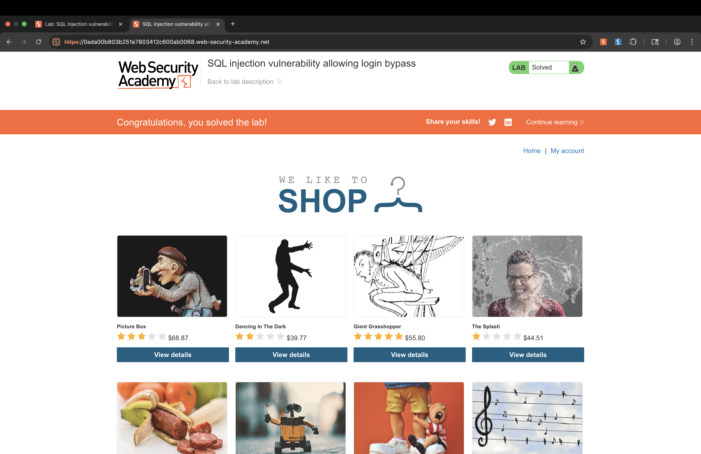

# Lab: SQL injection vulnerability allowing login bypass

## Objective: Demonstrate how to exploit an SQL injection vulnerability in the login form’s username and password fields to gain unauthorized access to an administrator account. This write-up will guide you through the process of identifying the vulnerability, executing the attack, and interpreting the results, providing clear, step-by-step instructions to achieve the lab’s objective.

## Steps

### Step 1: Explore the Webpage and Locate the “My account” Tab

Begin by browsing the lab’s main webpage. Look for new or notable features—in this case, identify the “My Account” tab, which may provide user-specific functionality.

### Step 2: Access the Login Form

Click on the “My Account” tab. You should see a login form requesting a username and password. This form is a potential entry point for testing SQL injection vulnerabilities.

### Step 3: Enter Credentials into the Login Form

Enter "administrator" in the username field and any value in the password field to observe the application's response to a standard login attempt. While this will not grant access, it helps identify how the application processes input and whether the login form may be vulnerable to SQL injection attacks.

### Step 4: Capture the Login Request with Burp Suite Interceptor

Now, with Burp Suite’s Interceptor enabled, resubmit the login form to capture the HTTP request as it is sent to the server. When you review the captured request in the HTTP history, you will notice that it explicitly mentions an SQL injection vulnerability. This clear indicator confirms that the login form is susceptible to SQL injection, providing a direct opportunity to proceed with crafting a targeted attack.

### Step 5: Craft the SQL Injection Payload in the Repeater

Send the intercepted login request to Burp Suite’s Repeater. In the username field, modify the input by appending a SQL comment sequence (e.g., username’–). This alteration is designed to manipulate the backend query and bypass password verification.

### Step 6: Send the Crafted Request and Forward the Packet

Use the crafted request in Repeater and resend it. Alternatively, forward the modified packet through Interceptor to the server. If successful, this should log you in as the administrator by bypassing authentication controls.

### Step 7: Verify Success on the Homepage

Return to the homepage. If the SQL injection was successful, you will see a congratulatory message indicating you have completed the lab and gained administrator access.

## Key Takeaways

- SQL injection vulnerabilities can often be found in login forms and other places where user input is processed by backend databases.
Manual testing and careful observation of application behavior are essential for discovering and confirming exploitable flaws.
- Tools like Burp Suite make it easier to intercept, modify, and replay HTTP requests, providing valuable insight into how an application processes input.
- Crafting targeted payloads, such as using SQL comment syntax (--), can allow attackers to bypass authentication and gain unauthorized access.
- Always verify the impact of successful exploitation by checking for changes in access or application responses.
- Regular security testing and code review are critical to maintaining the integrity and safety of web applications.